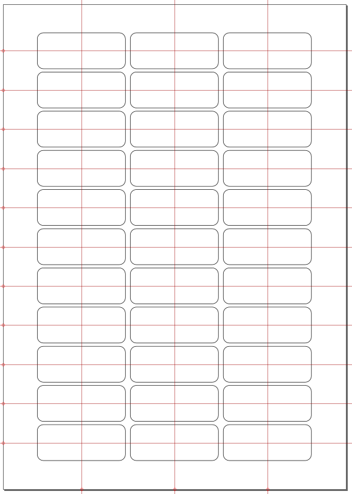
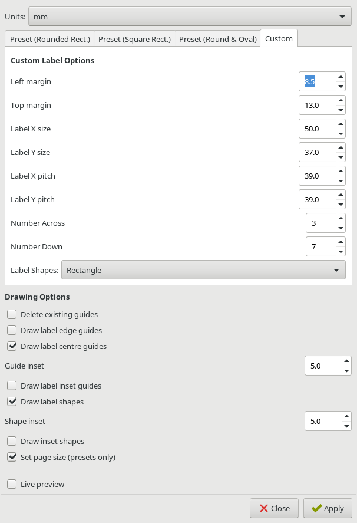

# Label Guide extension

This is an extension to draw guides and outline for printable label sheets.
There is a fairly large range of labels, mostly from LabelPlanet and Avery.

The InkSpace extension page is
[here](https://inkscape.org/en/~jjbeard/%E2%98%85label-guides).

This is what the output can look like:

And the options dialog:

## Features

* List of around 100 preset label templates
* Custom rectangular and elliptical grid-based templates
* Various guide options. Any combination of:
  * Guides at label edges
  * Guides at label centres
  * Guides inset from edges by a set amount
* Can draw label outline shapes for visualisation before printing
* Can draw inset shapes to aid layout or as borders

## Installation

### Manual installation

Copy the `label_guides.py` and `label_guides.inx` files to the relevant
Inkscape extension directory.

On Linux, this is `~/.config/inkscape/extensions` for user extensions or
`/usr/share/inkscape/extensions` for system extensions.

### Makefile

You can clone this repository and use `make` to install the extension to
your user extension directory (Linux only, maybe OSX):

    make install

or

    make install DESTDIR=/path/to/install/directory

### Arch Linux

There is an AUR package called
[`inkscape-label-guides`](https://aur.archlinux.org/packages/inkscape-label-guides/).
